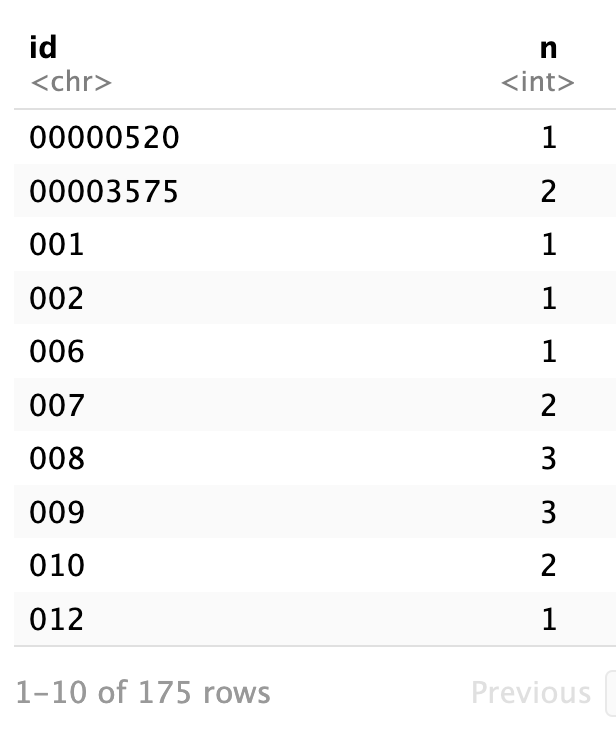
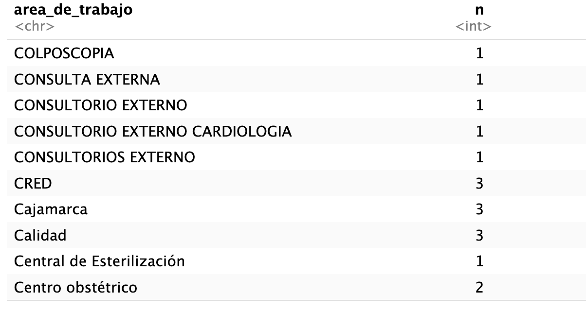
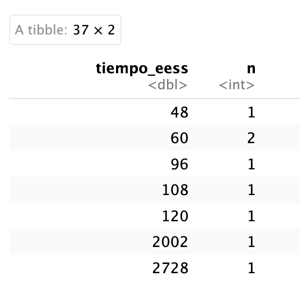

```{r setup, include=FALSE}
knitr::opts_chunk$set(echo = TRUE)
```

```{r loading packages, echo=FALSE, message=FALSE}

if(!require(pacman)) install.packages("pacman")
pacman::p_load(tidyverse, 
               knitr, 
               here,
               janitor,
               inspectdf,
               gtsummary,
               haven,
               stringi)

```

## Introducción

La percepción de corrupción, discriminación y violencia son fenómenos complejos que afectan a diversos sectores de la sociedad, incluyendo el ámbito de la salud. En los trabajadores de salud, estos factores pueden tener implicaciones significativas no solo en su bienestar emocional, sino también en la calidad de los servicios que brindan (Hennein et al., 2023; Mackey & Liang, 2012). La percepción de corrupción, en particular, ha sido asociada con un deterioro en la confianza hacia las instituciones y una disminución en la satisfacción laboral por parte de los trabajadores (León et al., 2014). Además, una mayor percepción de corrupción se asocia inversamente con la percepción de bienestar en trabajadores (J et al., 2022).

Por otro lado, la discriminación en el lugar de trabajo ha mostrado una fuerte relación con el desarrollo de problemas emocionales, como la ansiedad y los trastornos del sueño (Maglalang et al., 2021; Ormiston et al., 2024). Además, la percepción de ser discriminados también se asocia negativamente con el desempeño y la calidad de atención que brindan por parte de los trabajadores (del Carmen Triana et al., 2015; Pascoe & Smart Richman, 2009).

La violencia, tanto física como verbal, representa un desafío significativo para el personal de salud. Un meta-análisis reveló que el 42.5% de los trabajadores de salud reportó haber estado expuesto a violencia no física, mientras que el 24.4% experimentó violencia física en el último año (Liu et al., 2019). Además, se observó una alta prevalencia de abuso verbal (57.6%), amenazas (33.2%), y acoso sexual (12.4%) en los trabajadores de salud (Liu et al., 2019). Además, experiencias de violencia se asocian fuertemente a la presencia de problemas emocionales como síntomas depresivos y ansiosos (A et al., 2022).

Dado este contexto, el presente estudio tiene como objetivo explorar las asociaciones entre la percepción de corrupción, discriminación y violencia con la presencia de problemas emocionales en una muestra de trabajadores de salud peruanos. Este enfoque permitirá identificar áreas críticas de intervención para mejorar tanto la salud mental del personal como la calidad de los servicios de salud.

## Métodos

### Diseño de estudio
Estudio secundario en el cuál se analizó la Encuesta Nacional de Satisfacción del personal de salud de hospitales del Ministerio de Salud y Gobiernos Regionales en el Sistema de Salud Peruano (ENSUSALUD 2024).

Esta encuesta tiene un diseño transversal y fue realizada en profesionales de salud que trabajan en hospitales públicos adscritos al Ministerio de Salud (MINSA) y los Gobiernos Regionales (GOREs) en Perú durante el primer semestre del año 2024.

### Población
Se incluyó a profesionales profesionales de medicina, enfermería u obstreticia en las IPRESS seleccionados por al menos 12 meses continuos en la IPRESS. Se excluyó a aquellos que no puedan responder debido a un accidente cerebro vascular con secuelas, aquellos que no desean participar o que no firmen el consentimiento informado. Además, se excluyó a aquellos que realicen exclusivamente teletrabajo.

Se eliminó de la base de datos a aquellos que no completaron el cuestionario por completo.

### Tamaño de muestra


### Muestreo 

Se realizó un muestreo probabilístico aleatorio simple en base al listado de todos los profesionales de la salud registrados en las oficinas de personal o recursos humanos. Se utilizó una página web (www.random.org) para seleccionar a los participantes de forma aleatoria. 

Se definirán cuotas por grupos de edad (18 a 39 años, 40 a 65 años) y de profesión (medicina, enfermería y obstetricia) individualizadas para cada IPRESS (con afijación proporcional). [Revisar esta parte. No me parece que se haya hecho]

### Variables y medición
Se consideraron variables sociodemográficas como: ...

Además, las variables de interés corrupción, discriminación y violencia...

### Análisis de datos


```{r = explorando base, echo=FALSE, message=FALSE}

#data <- readxl::read_xlsx(here("data/Database_4_non-id.xlsx")) %>% 
  #select(1:24, 84:99, 143:145) #violencia, corrupcion

data2 <- readxl::read_xlsx(here("data/Database_4.xlsx")) %>% 
  clean_names() %>% 
  rename(id = ingresar_un_codigo_alfanumerico_por_participante_iniciales_y_numero_de_participante,
         nombre_ipress = nombre_de_la_ipress,
         distrito_ipress = distrito,
         profesion = x1_cual_es_su_profesion,
         edad = x2_cual_es_su_edad,
         departamento = x3_1_en_que_departamento_vive,
         provincia = x3_2_en_que_provincia_vive,
         distrito = x3_3_en_que_distrito_vive,
         sexo = x4_cual_es_su_sexo,
         estado_civil = x5_cual_es_su_estado_civil_o_conyugal,
         grupo_etnico = x6_del_listado_mostrado_con_que_grupo_etnico_usted_de_identifica,
         vivienda = x7_la_vivienda_que_ocupa_en_su_hogar_es,
         idioma = x8_con_respecto_al_dominio_de_otro_idioma_distinto_al_espanol_usted_domina,
         vive_familia = x9_actualmente_usted_vive_con_su_familia,
         fuente_ingreso = x10_usted_es_la_unica_fuente_de_ingresos_de_su_hogar,
         dependientes = x11_cuantas_personas_dependen_economicamente_de_usted,
         dejo_familia = x12_actualmente_usted_ha_tenido_que_viajar_y_dejar_a_su_familia_para_trabajar_en_este_establecimiento,
         universidad = x13_en_que_universidad_se_titulo,
         ano_titulacion = x14_en_que_ano_obtuvo_su_titulo_universitario,
         especialidad = x16_tiene_alguna_especialidad_o_subespecialidad,
         dejar_eess = x25_actualmente_piensa_o_tiene_planificado_dejar_de_trabajar_en_este_establecimiento,
         factor_dejar_eess = x26_que_factores_influirian_mas_en_usted_para_cambiar_de_trabajo,
         tiempo_eess = x28_cuantos_anos_viene_laborando_en_este_establecimiento_de_salud,
         horas_semana = x33_en_promedio_cuantas_horas_trabaja_a_la_semana_en_todas_sus_actividades_remuneradas) %>% 
  mutate(distrito_ipress = stri_trans_general(str_to_title(distrito_ipress), "Latin-ASCII"),
         distrito_ipress = case_when(distrito_ipress == "Vitarte" ~ "Ate Vitarte",
                                     TRUE ~ distrito_ipress),
         edad = as.numeric(edad),
         departamento = stri_trans_general(str_to_title(departamento), "Latin-ASCII"),
         departamento = case_when(departamento == "Arequip" ~ "Arequipa",
                                  departamento == "San Borja" ~ "Lima",
                                  departamento == "Tarma" ~ "Junin",
                                  departamento == "Cabana" ~ "Puno",
                                  TRUE ~ departamento),
         provincia = stri_trans_general(str_to_title(provincia), "Latin-ASCII"),
         distrito = stri_trans_general(str_to_title(distrito), "Latin-ASCII"),
         distrito = case_when(distrito == "Ate" ~ "Ate Vitarte",
                              distrito == "Chorrilllos" ~ "Chorrillos",
                              distrito == "Puenlo.libre" ~ "Pueblo Libre",
                              distrito == "San Martin Porres" ~ "San Martin De Porres",
                              distrito == "Rupa- Rupa" ~ "Rupa-Rupa",
                              distrito == "Chaclayo" ~ "Chiclayo",
                              TRUE ~ distrito),
         grupo_etnico = case_when(grupo_etnico == "2"  ~ "Aimara",
                                  grupo_etnico == "23" ~ "Kandozi",
                                  grupo_etnico == "40" ~ "Quechuas",
                                  grupo_etnico == "49" ~ "Uro",
                                  grupo_etnico == "50" ~ "Vacacocha",
                                  grupo_etnico == "57" ~ "Blanco",
                                  grupo_etnico == "58" ~ "Mestizo",
                                  grupo_etnico == "59" ~ "Asiatico Descendiente"),
         vivienda = stri_trans_general(str_to_title(vivienda), "Latin-ASCII"),
         vivienda = case_when(
    # Group 1: CASA FAMILIAR
           vivienda %in% c("Casa De Hna", 
                                  "Casa Familiar", 
                                  "Casa Familiar (Familia Paterna)", 
                                  "Familiar", 
                                  "Vivienda De Padres", 
                                  "Vive En Casa De Su Madre", 
                                  "Vivienda Familiar", 
                                  "Casa De Los Padres", 
                                  "Casa De Padres", 
                                  "Casa De Sus Padres", 
                                  "Casa De Un Familiar", 
                                  "De Mis Padres", 
                                  "De Sus Padres", 
                                  "Casa De Los Padres", 
                                  "Casa De Mis Padres", 
                                  "Casa De Un Familiar", 
                                  "De Sus Padres") ~ "Casa Familiar",
    
    # Group 2: ALQUILADA
    vivienda == "?Alquilada?" ~ "Alquilada",
    
    # Group 3: CEDIDA
    vivienda == "?Cedida por otro hogar o institutción?" ~ "Cedida",
    
    # Group 4: PROPIA, PAGANDO
    vivienda == "?Propia, Pagando A Plazos O Cuotas?" ~ "Propia, Pagando",
    
    # Group 5: PROPIA, TOTALMENTE PAGADA
    vivienda == "?Propia, Totalmente Pagada?" ~ "Propia, Totalmente Pagada",
    
    # Group 6: OTROS
    vivienda %in% c("Heredada", 
                    "Herencia de mi suegro", 
                    "Propia/Herencia") ~ "Otros",
    
    # Keep existing values if no match
    TRUE ~ vivienda
  ))

#No considerando las siguientes variables: idioma, vive_familia, fuente_ingreso, universidad, tiempo_eess

#evaluar si es de interes: factor_dejar_eess, horas_semana (la gente hace guardias, ¿cómo considerar el número de horas?)

#str(data2)
#names(data2) 
#get_dupes(data2) # no duplicates

# separando el codigo de limpieza en dos porque con uno solo no corre
data2 <- data2 %>% 
  mutate(ano_titulacion = case_when(ano_titulacion == 20 ~ 2020,
                               TRUE ~ ano_titulacion))

#data2 %>% count(horas_semana)

#class(data2$ano_titulacion)

```

## Resultados

### Muestra

```{r datos sobre la muestra, echo=FALSE, message=FALSE}
# Muestreo
n_muestra <- data2 %>% 
  summarize(n_participantes = nrow(data2),
            n_ipress = n_distinct(codigo_renipress),
            n_distrito_ipress = n_distinct(distrito_ipress))
```

Se entrevistó a un total de `r n_muestra[1,1]` que laboraban en `r n_muestra[1,2]` establecimientos de salud localizados en `r n_muestra[1,3]` distritos del país.

### Descripción de la población de estudio


```{r variables sociodemográficas, echo=FALSE, message=FALSE}
#Tabla 1. Descripción de la población
#revisando variables sociodemograficas
tabla1 <- data2 %>% 
  select(c(edad, profesion, sexo, estado_civil, grupo_etnico, vivienda, dependientes,dejo_familia)) %>% 
  tbl_summary(statistic = list(edad ~ "{median} ({min} - {max})"),
              label = list(edad = "Edad (años)",
               profesion = "Profesión",
               sexo = "Sexo",
               estado_civil = "Estado civil",
               grupo_etnico = "Grupo étnico",
               vivienda = "Tipo de vivienda",
               dependientes = "Número de personas dependientes del participante",
               dejo_familia = "Tuvo que dejar familia por trabajo")) %>%
  modify_header(label ~ "**Características**") %>%
   modify_caption("**Tabla 1: Resumen descriptivo de las variables sociodemográficas**")

per_mujer <- tabla1 %>%
  inline_text(variable = "sexo", level = "Mujer")

edad_sum <- data2 %>% 
  summarize(median = median(edad, na.rm = T),
            min = min(edad, na.rm = T),
            max = max(edad, na.rm = T))

prof_sum <- data2 %>% 
  select(profesion) %>% 
  group_by(profesion) %>% 
  summarize(count = n(),
            perc = round((count/nrow(data2)*100),1)) %>% 
  arrange(desc(count))

#inspect_num(data2) %>% 
 # show_plot()
```

La mediana de la edad de los participantes fue de `r edad_sum[1,1]` años con un rango de `r edad_sum[1,2]` a `r edad_sum[1,3]`. `r per_mujer` de los participantes fueron de sexo femenino. La mayoría tenía como profesión `r prof_sum[1,1]` (`r prof_sum[1,2]`, `r prof_sum[1,3]`%).

La siguiente tabla muestra las características sociodemográficas de los participantes.

```{r echo=FALSE, message=FALSE}

tabla1

```

```{r especialidad, echo=FALSE, message=FALSE}

esp_sum <- data2 %>% 
  select(especialidad) %>% 
  group_by(especialidad) %>% 
  summarise(count = n(),
            per_esp = round((count/nrow(data2)*100),1)) %>% 
  arrange(desc(count))

```

La mayoría de los participantes se titularon en los últimos 15 años. La mayoría (`r esp_sum[2,1]`, `r esp_sum[3,1]`%) contaba con una especialidad y `r esp_sum[2,3]` (`r esp_sum[3,3]`%) estaban realizando una.

En el siguiente gráfico se puede observar la distribución del año de titulación.

```{r echo=FALSE, message=FALSE}

ano_titulacion_graph <- data2 %>% 
  ggplot(aes(x = ano_titulacion)) +
  geom_histogram() +
  labs(title = "Distribución del año de titulación de los participantes",
       x = "Año de titulación",
       y = "N") +
  theme_minimal()

ano_titulacion_graph
```


### Descripción de las variables de interés

Violencia....

Corrupción...

```{r}
#Tabla 2. Violencia y corrupción

```

### Variables sociodemográficas asociadas a violencia

```{r}
# Tabla 3. Factores asociados a violencia

```

### Variables sociodemográficas asociadas a la percepción de corrupción

```{r}
# Tabla 4. Factores asociados a percepción de corrupción

```


### Otras a explorar

```{r}
#dejar_eess

```


## Recomendaciones

- Crear un código de identificación por participante que sea único y eliminar los nombres completos de la base de datos.

 
 
 Si bien hay 191 participantes, solo hay 175 códigos. En la imagen se puede apreciar que dos participantes con el código 007, por ejemplo.
 
 - Definir bien las variables y brindar opciones de respuesta para que la persona comprenda qué se le está preguntando.
 
 Por ejemplo, la variable area de trabajo tiene respuestas que se refieren a la región, al puesto que ocupa la persona, al programa, al departamento, etc.
 
  
 - Brindar un desplegable para departamento, provincia y distrito. Esto facilita la limpieza de la base de datos y evita respuestas erroneas. 
 
 Por ejemplo, la variable de departamento tiene respuestas no plausibles como "San Borja" o "Tarma"
 
 - Crear una variable por idioma. Esto es posible dependiendo del software/plataforma que se utilice para crear la encuesta. Un ejemplo de un software libre es Redcap, pero necesitan un acceso de una entidad académica. Hay una opción para crear preguntas de opción multiples y almacenar los resultados en diferentes variables de tipo sí/no.
 
 - Considerar colocar restricciones para algunas variables numéricas. Por ejemplo, en el caso del tiempo en años viviendo en el establecimiento, hay valores inconsistentes. Esto se puede evitar colocando un máximo de años que sera creíble (¿menos de 100?)
 
   
 